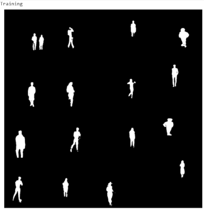

# Final Assignment 

# Monocular Mask and Depth Estimation Model
  
:link: Link to Custom Dataset: https://drive.google.com/drive/folders/1RbJHVxo91jhekv3_E9GZvujUDNDaxFQu

:link: Link to how the Dataset was created: https://github.com/Deeksha-Pandit/EVA4-S14/blob/master/Final/README.md 

:link: Link to colab notebook for assignment 15: https://github.com/Deeksha-Pandit/EVA4-S15/blob/master/Final_Assignment.ipynb

:pushpin: __Highlights__
 1) Dataset - Custom dataset containing living rooms as background and humans as foreground
 2) Input 
    - Background Images (100) 
    - Foreground-Background Images (400K)
    - Foreground-Background-Mask Images (400K)
    - Depth Images (400K)
 3) Output
    - Foreground-Background-Mask
    - Depth Images
 4) Model - UNet 
 5) No. of parameters - 33,389,314
 6) Loss Function for Mask images: BCEWithLogitsLoss()
 7) Loss Function for Depth images: L1Loss()
 8) Optimizer: SGD with momentum and weight decay
 9) Scheduler: OneCycleLR()
 10) Epochs - Depth: 4 epochs , Masks: 3 epochs
 11) Iou Results ~ 0.8109732806682587

:arrow_right: **Files Used:**
1) [All Models](my_model.py) - Contains all models used in EVA4 until now
2) [Albumentation Transforms](Albumentations.py) - Contains the transforms used in this assignment
3) [Splitting the dataset](SplitDataset.py) - Contains code to split dataset into train and test set
4) [Display Images](DisplayImages.py) - Contains code to display various kinds of images
5) [Custom Dataset](MyClass.py) - Contains Custom dataset class 
6) [UNet Model](UNetModel.py) - Conatins the model used in this particular assignment

:arrow_right: **Data Formats:**

- All our images are in .jpg format
This was done to keep our dataset to a minimum size for further computations.

:arrow_right: **Fetching the Data:** :hammer_and_pick:
- So the biggest challenge of this assignment was how to load such huge amount of data :question:
- First, I tried to load a small amount of data (say 20 images of each kind) into colab
- Then I tried to convert them into numpy arrays and tried to store them in a list - since we have to input 4 kind of images
- After storing in a list, when I tried to retrieve the images via these numpy arrays, I landed up in a lot of errors due to channel mis-match and resizing issues
- This created a lot of confusion and I thought I would give up on the whole assignment because I was stuck with errors for days :coffin:
- Then I decided to finally change my approach and restarted the whole assignment from scratch
- This time I thought of loading the paths of the dataset into colab instead of saving them in a list and converting to arrays etc
- I stored the paths of the 4 kinds of images in variables and extracted each of these paths locally into colab

Code Snippet:
```
archive1 = zipfile.ZipFile(f'/content/gdrive/My Drive/Mask_Rcnn/Dataset/data_part1.zip')
archive1.extractall()
```
- Also created a Background folder and loaded 100 bg images into colab
- I saved all of these folders into variables to be used later

Code Snippet:
```
bg = sorted(glob.glob('/content/Background/*',recursive=True)) 
```
- This saves a lot of time and RAM , it just takes 3-4 mins to extract the zip files into colab without eating away any RAM space
- Such a relief, I could finally get hold of the data :sweat_smile:

:arrow_right: **Custom Dataset class:** :scroll:
- [Code to custom dataset class](MyClass.py)
- I wrote a class named CustomDataset
- It contains __init__ method to initialise the transforms and also the 4 file paths which were created with the 4 types of files
- Also containts __len__ to store fg_bg length :straight_ruler:
- The __getitem__ function containts 'bg_index' which makes sure that each of the 100 background images is mapped to each of the fg-bg, fg-bg-mask and depth images
- This was done by using: bg_index = index//4000 (i.e for 1 bg images 4000 fg-bg (and mask and depth) would be mapped)
- Also if any transforms were available, the transforms would be applied to the images at this point in the code

:arrow_right: **Albumentations:** :rainbow:
- [Link to Albumentation Transforms](Albumentations.py)
- I did not use too many transforms
- Just used resize to first run the model on 64x64 size images
- Then changed the resize function to 224x224 image size, this was done so that I experiment on small resolution images first and then     go for the bigger ones
- Apart from that I have added ColorJitter() :tada:
- Normalised with the mean and std of Fg-Bg images which we had calculated for the previous assignment
- At last converted to ToTensor()

:arrow_right: **Train Test Split:** :scissors:
- [Code to splitting the dataset](SplitDataset.py)
- So the requirement was to split the whole 400k dataset into 70:30 :: train:test
- As we had also done this for imagenet dataset in previous assignment, I implemented it in the same way
- First I split the len() of whole dataset into 70% and then the remaining 30% would be the test data :bar_chart:
- Then after this I ran random_split() functionality on these 70:30 split images - to generate random images for test and train
- However, this was generating random images for every batch and so I had to use SEED: ```timetorch.manual_seed(0)``` so that a fixed     set of images are generated per batch
- And then applied random_split() after SEED

:arrow_right: **Dataloader:** :repeat: 
- To load the data I called the DataLoader item twice - once for train set and once for validation set
- First, I experimented for images of size (resized) 64x64 (to test with reduced size images) - for this I gave a larger batch_size of about 128
- This worked well , and was faster :thumbsup:
- Then as for transfer learning, I did not resize the images but had to reduce batch_size greatly and made it 32 (so that cuda does not run out of memory)
- This completed the data loading process :relieved: 

:arrow_right: **UNet model:** :boom:
- [Code to UNet Model](UNetModel.py)
- Link to my model: 
- So after trying various models available, I choose to work with UNet model :heavy_check_mark:
- I tried using ResNet like our previous assignments and also various types of Autoencoders - but the results never looked good and I had lot of difficulties dealing with the input data
- UNet is also an encoder-decoder model useful for detecting very minute data in medical field like tumur and cell detection.Hence it     proved to be perfect to detect masks and depth images
- There is no dense layer in UNet model, so images of different sizes can be used as input - So I first tried running the model on 64x64 size images and then switched to the 224x224 images of our dataset (transfer learning) :trollface:
- The only change I had to make was pass two images in the model summary instead of one (which we were passing earlier)
```summary(model, input_size=[(3,64,64),(3,64,64)])```
- **No. of parameters: 33,389,314** :stuck_out_tongue:
- Architecture of model:


The U-Net architecture is built upon the Fully Convolutional Network and modified in a way that it yields better segmentation in medical imaging. Compared to FCN-8, the two main differences are 

(1) U-net is symmetric and  
(2) the skip connections between the downsampling path and the upsampling path apply a concatenation operator instead of a sum.

These skip connections intend to provide local information to the global information while upsampling. Because of its symmetry, the network has a large number of feature maps in the upsampling path, which allows to transfer information. By comparison, the basic FCN architecture only had number of classes feature maps in its upsampling path. The U-Net owes its name to its symmetric shape, which is different from other FCN variants.

U-Net architecture is separated in 3 parts:

  :small_blue_diamond: The contracting/downsampling path
  
  :small_blue_diamond: Bottleneck
  
  :small_blue_diamond: The expanding/upsampling path

:sunglasses: However, for our assignement, I have made a few changes in the model:
  1) I first have some common layers for both depth and mask images (common layers I choose are: down1, down2 and down3)
  2) Then I split the layers into two - one set for mask and another set for depth images :coffee:
  3) For this I choose the remaining layers and changed the sizes accordingly so that it duplicated the UNet architecture
  4) While running the model for depth images, I first frooze the mask layers which were newly created then ran the model and obtained     the results. 
  5) While running the model for mask images, I frooze the depth layers which were newely created and ran the model to obtain results
  6) To freeze the code, I used this code:
  
```
#Freeze the layers
count = 0
for child in model.children():
   count += 1
   if count < 4 or count > 10:
     for param in child.parameters():
         param.requires_grad = False
```

- Finally the model would return logits_mask if we are running model for mask images or it would return logits_depth if we are running model for depth images
- Modified model flow chart:


- So this is all about the model. It was not that easy, with a lot of research and trail and error these changes were made :performing_arts:

:arrow_right: **Display Images:** :framed_picture:
- [Code to Display Images](DisplayImages.py)
- Wrote a small function to display the images of any kind by just calling the display_image(img) function
- Example of fg-bg images after applying transforms:  


:arrow_right: **Train and Test:** :running:
- Train and test functions do not change much, they are similar to what we used in previous assignments
- In these functions we load each of the 4 types of images (background, fg-bg, fg-bg-mask and depth images)
- I also changes the test() code a little to include the IoU metric to measure the accuracy of our model
- And then here comes another hurdle................ :construction:
- We had to decide upon the hyperparameters for the training and testing, that would work perfectly with our model :thinking:
**LOSS FUNCTIONS:**
- I tried with quite a few loss functions:
  1) MSELoss() - Did not give good results
  2) CrossEntropyLoss() - Did not fit best for our dataset images
  3) BCEWithLogitsLoss() - This worked best for mask images and this is the loss function I used for mask images , but for depth images   it gave this kind of output even after a few epochs: 
  4) L1Loss() - Then I realised I have to use different loss functions for both depth and mask images and planned to go with L1Loss()     for depth images and this worked well  
- Also, I used the same optimizer (with momentum and weight decay) and schedular as used in previous assignment, so this helped me speed   up the process :dart: 

Code Snippet:
```
optim = torch.optim.SGD(model.parameters(), lr=0.01,momentum=0.9,weight_decay = 0.0001) 
#criterion = nn.L1Loss()                #Used for depth images
criterion = nn.BCEWithLogitsLoss()      #Used for mask images
scheduler = OneCycleLR(optim, max_lr = 0.02, total_steps=None, epochs=30, steps_per_epoch=len(train_dataloader), pct_start=1/3, anneal_strategy='linear', cycle_momentum=True, base_momentum=0.85, max_momentum=0.95, div_factor=10.0,final_div_factor =10)
```
:heavy_exclamation_mark: So then, just when I thought everything is in place and now my life will be simpler.......
- I started training for depth images first as you can see by the outputs in the .ipynb 
- It ran perfectly for 3 epochs and also gave me good results
- But as soon as I started running the 4th epoch, the disk space in colab starting running out of memory and after a lot of training,     it crashed and the epoch just stopped in between :eyes:
- I was clueless as to why this was happening as this never happened before
- Then I used **timeit** to check which part of my code in tarining is taking too long :hourglass_flowing_sand:
- After a few trial and errors, I realised this was happening due to the weights being saved every few seconds - this was loading the     colab disk and crashing as soon as the disk was full
- I then changed the condition in train() and edited it to save lesser number of times
```
if batch_idx % 2000 == 0:
        torch.save(model.state_dict(), PATH/f"{batch_idx}.pth")
```
- This worked but still another major issue I faced was in training time - It took me almost a day or more to train and test my dataset for the outputs :tired_face: 

At the end I also used save and load codes for saving the weights of my model to drive after every epoch and load it back for the next epoch - in order to train in a better way :muscle:

Code Snippet:
```
torch.save(model, '/content/gdrive/My Drive/model_mask_1.pth')
model.load_state_dict(torch.load('/content/gdrive/My Drive/model_mask_1.pth'))
```
:arrow_right: **Outputs:** :heart_eyes:

1) __DEPTH__

  -**Ground truth** and Output for **Training** (epoch 4)

                                                   

  -**Ground truth** and Output for **Testing** (epoch 3)
  
                                                

2) __MASK__

  -**Ground truth** and Output for **Training** (epoch 3)

                                                  

  -**Ground truth** and Output for **Testing** (epoch 2)
  
                                                

:arrow_right: **Results:** :smile:
- Iou Results: Average Metric =  0.8109732806682587
- RMSE Results: Average Metric =  0.6715668320655823

:end: At the end I just prayed that all goes well. This project turned out to be a huge learning path. It will definetly help me cross many more hurdles in life :pray:

Thank you so much :blush:
